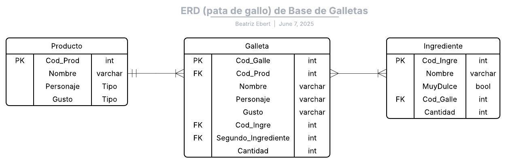
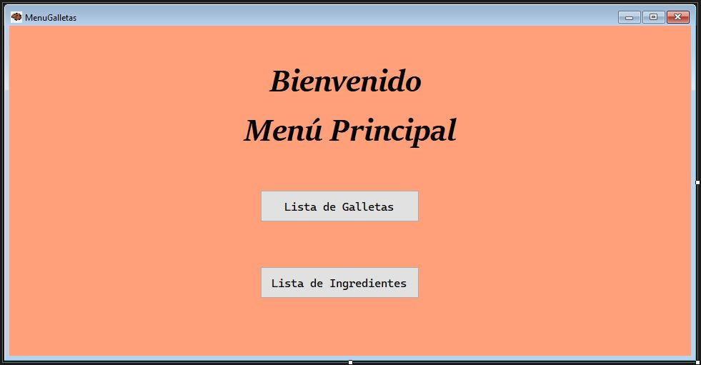
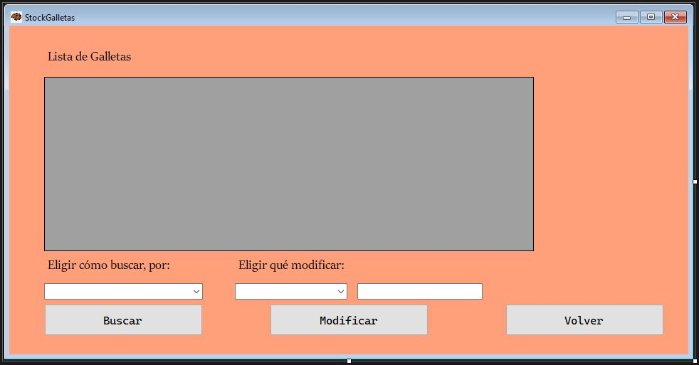
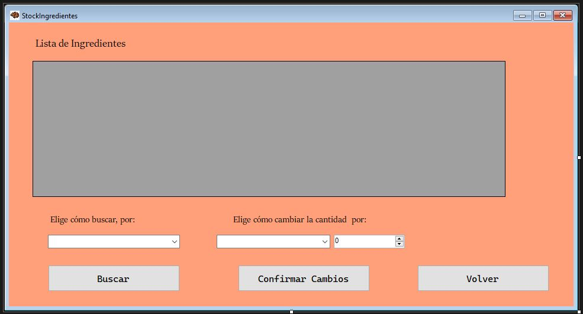

# Pequeña aplicación de Windows con Winforms para controlar stock (Aún en proceso)

*Este proyecto se realizo para el Curso Introducción a la Programación con C# de la Universidad Abierta Interamericana* 

El objetivo de la aplicación es controlar el stock de galletas personalizadas de una pequeña pastelería, no solo visualizar la cantidad que se encuentra preparada de galletas,
sino también la cantidad de ingredientes que se encuentran almacenados.
Esta es la idea tomada para formar la Base de Datos, por simplicidad se ignoró la tabla de Productos, y solo se uso la tabla Galleta y la tabla Ingrediente

La aplicación inicia con una ventana principal dónde se puede elegir con qué se quiere trabajar, si con la información de las galletas o de los ingredientes

La pantalla de información de galletas tiene su sector para visualizar la información de la Base de Datos. Tiene un menú desplegable para elegir según qué criterio se quiere buscar (si mostrar según el gusto o el personaje de diseño)

La pantalla de información de Ingredientes mantiene mismas caracteristicas de apariencia de las anteriores, también tiene los espacios para visualizar y buscar por una categoria como la ventana de Galletas, pero en vez de tomar la información de la tabla Galleta, es de la tabla Ingrediente, de la Base de Datos.

El patrón de diseño utilizado es el DAO, se encuentran las carpetas
- Entidades
- Implementaciones
- Interfaces
- Ventanas
- Dependencias

La Base de Datos se llama Productos  y es contenida en un servidor Microsoft SQL Server (local)

